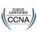

# Hi, I’m Andreansx 
    

I'm a 16 year old CCNA-certified self-taught Networking enthusiast and I am very interested in the underlying hardware that makes the Data center technologies possible. 

My primary focus and career goal is Data Center Network Engineering.   

Networking is what I learn for real but I also do stuff with Claude Code

### Toolkit

 
 

Recently I mostly switched from learning in my physical lab, to doing everything in my a lot more modern environment on my MacBook. I now run Arista cEOS using Containerlab in a ARM64 VM in OrbStack. This setup is unimaginably more efficient than an old Dell R710 and physcial hardware. 

Currently my projects and learning interests include:

*  Modern approach to networking with Arista cEOS, OrbStack and Juniper cRPD
*  Network automation and IBN with Ansible, Jinja2 templates and Netbox as a Single Source of Truth
*  Spine-Leaf architecture which I have already implemented in my lab
*  EVPN VXLAN which I'm also learning about
*  Hardware architecture, packet processing inside switching engines, TCAM memory and hardware level restrictions for RIOT

Click the Card below to browse through all my documentantion. 

  

This is coded with opus but it's cool

### Contact

_Always open to chat with fellow networking, Linux and Apple enthusiasts!_  
 

