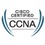

# Hi, I’m Andreansx 
    

I'm a 17 year old CCNA-certified self-taught focused on internet routing and edge infrastructure, Anycast BGP and Linux-based routing with BIRD. 
My primary focus and career goal is Data Center Network Engineering.   

Networking is what I learn for real, but I also mess around with IDA and Claude Code for reverse engineering of software and research.   

As of now I'm in the process of setting up my own Autonomous System with a PI IPv6 /48 which will be originated from two Points of Presence (Vultr and iFog) with eBGP to upstreams and iBGP down through Wireguard tunnels to my MikroTik CCR2004.   
And also there will be my own Looking Glass (`bird-lg-go`), served on two PoPs, so it will take advantage of anycast BGP. I would also want to set up my own nameservers on those PoPs.    
### Toolkit

 
 

I now run Arista cEOSes and Alpine Linux with BIRD using Containerlab in a ARM64 VM in OrbStack. This setup is unimaginably more efficient than an old Dell R710 and physcial hardware. Though I would like to get back to my dell s4048-on with os10 sometime.   

Currently my projects and learning interests include:

*   Bringing up my own AS which is a RIPE-provided PI IPv6 /48 anycasted from two PoPs (Vultr and OCI VPS through BGPTunnel) with full iBGP mesh through wireguard tunnels.   
*   BIRD routing and architecture, I'm learning to write filters and also setting up BGP sessions between contenerized routers. You can take a look [here](https://github.com/Andreansx/Networking-lab/tree/main/projects/27-ibgp-bird-cEOS-wireguard), this is a demo or a PoC for my AS setup.
*   Routing security, RPKI ROAs, IRR route6 objects, filtering AS_PATH and prefix and MANRS-aligned policy
*   Labbing with Linux, cEOS and cRPD containers in Containerlab.   
*   Network automation with Jinja2 and Ansible and a bit with Nornir   

Click the card below to browse all my documentation.  

  

### Reverse engineering & systems so like side projects with Claude. This is just for fun

Running an i386 Heidenhain TNC640 Vbox appliance under FEXemu on Apple Silicon, cause emulating a Win11 PC on ARM64 is too power-hungry:

    

ARM64 Apple Silicon & Metal port of the game Casualties: Unknown (up to 7.0 demo)

    

### Contact

_Always open to chat with fellow BGP, networking, UNIX and Apple enthusiasts!_  
 

